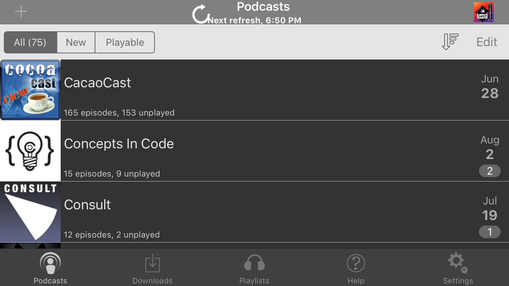
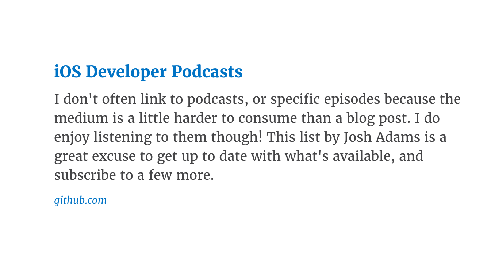
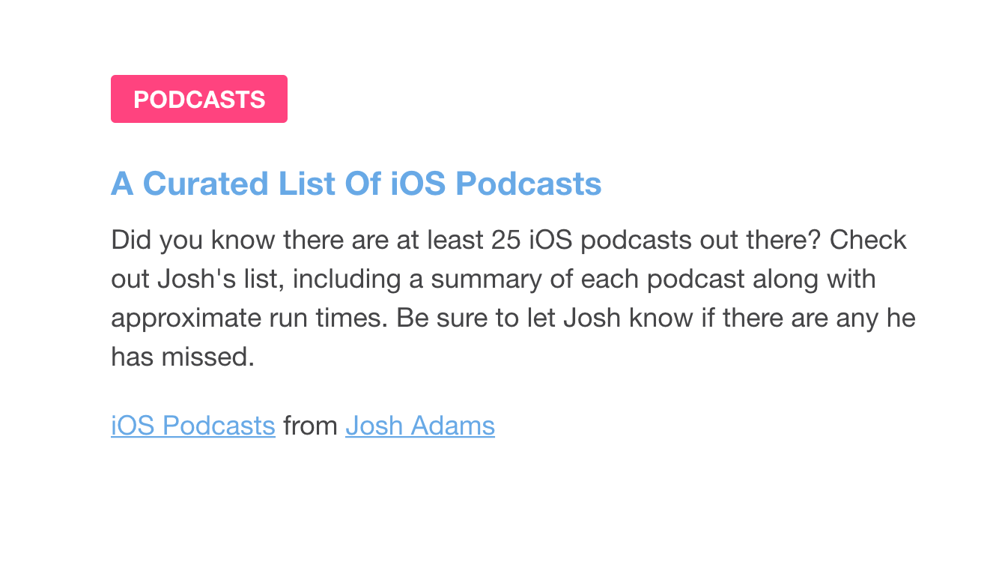

iOS-Development Podcasts
===================

The following is a list of podcasts of interest to iOS developers. Frequencies are approximate. Average length is of the past three episodes as of July 7, 2016. Corrections and suggestions are welcome. Most URLs are for the RSS feeds, but some are for the podcasts' websites.

### Accidental Tech Podcast
* Description: A Perl developer and two iOS developers discuss news from the Apple ecosystem and [other](http://automobiles.honda.com/accord-sedan) topics.
* URL: http://atp.fm/episodes?format=rss
* Frequency: weekly
* Average Length: 1:39:15

### Build Phase
* Description: Three iOS developers discuss knotty programming [problems](https://github.com/thoughtbot/Argo) they are facing. This is arguably the most technical iOS podcast.
* URL: http://simplecast.com/podcasts/272/rss
* Frequency: weekly
* Average Length: 44:03

### CacaoCast
* Description: Two iOS developers discuss in French events and tools of interest to iOS developers. Though both are residents and apparently natives of Quebec, the untrained ear can detect a Quebec [accent](https://fr.wikipedia.org/wiki/Français_québécois) on only one of the hosts.
* URL: http://cacaocast.com/rss
* Frequency: monthly
* Average Length: 46:24

### Coding Blocks
* Description: Three .NET and Javascript developers discuss the art of programming. This is a beard-friendly podcast.
* URL: http://www.codingblocks.net/feed/
* Frequency: monthly
* Average Length: 1:53:50

### Concepts in Code
* Description: An iOS and a Java developer discuss development of a side project and other software-development subjects. The catchy intro song brings to mind the [Indigo Girls](https://www.youtube.com/watch?v=HUgwM1Ky228), a folk band founded in 1985.
* URL: http://conceptsincode.com/rss
* Frequency: monthly
* Average Length: 39:49

### Consult
* Description: A freelance iOS developer interviews a different guest each episode about contract iOS development. The host is a graduate of the college where BASIC was invented.
* URL: http://consultpodcast.com/rss
* Frequency: monthly
* Average Length: 1:07:08

### Core Intuition
* Description: An iOS and a macOS developer discuss the business of indie app development and, less frequently, more-technical subjects.
* URL: http://www.coreint.org/podcast.xml
* Frequency: weekly
* Average Length: 47:33

### Debug
* Description: A tech journalist and an iOS developer interview various guests about subjects of interest to residents of the Apple ecosystem.
* URL: http://www.imore.com/debug
* Frequency: intermittent
* Average Length: 1:29:15

### Fatal Error
* Description: Two iOS developers, including one of the community's most insightful [blog](http://khanlou.com)gers, "discuss topics at the cutting edge of iOS software architecture, Swift[,](https://www.grammarly.com/blog/what-is-the-oxford-comma-and-why-do-people-care-so-much-about-it/) and best practices."
* URL: http://fatalerror.fm
* Frequency: biweekly
* Average Length: 27:36

### iDeveloper Podcast
* Description: A Mac and iOS developer/[guru](https://youtu.be/9VojuJpUuE8?list=PLdr22uU_wISqm9QbnczWxXs9qyuWpSU4k) discuss Apple-software development and other topics.
* URL: http://blog.ideveloper.co
* Frequency: weeklyish
* Average Length: 31:43

### iOhYes
* Description: Three iOS developers discuss with a guest one iOS-development topic per episode.
* URL: http://feeds.5by5.tv/iohyes
* Frequency: weekly
* Average Length: 1:01:45

### iPhreaks
* Description: A Ruby developer and two iOS developers discuss with a guest one iOS-development topic per episode. The intro riff is a perhaps-unintentional homage to Police guitarist [Andy](https://www.youtube.com/watch?v=ZSShauY8D3w) [Summers](https://www.youtube.com/watch?v=mbv-LcdLY-Y).
* URL: https://devchat.tv/iphreaks
* Frequency: weekly
* Average Length: 55:19 

### Mobile Couch
* Description: Two iOS developers discuss various iOS-development topics.
* URL: http://mobilecouch.co/rss
* Frequency: biweekly
* Average Length: 45:24

### More Than Just Code
* Description: A rotating cast of iOS-developer hosts discuss news of interest to iOS developers.
* URL: http://mtjc.fm/feed/podcast/
* Frequency: weekly
* Average Length: 1:31:26

### Programming Throwdown
* Description: Two developers discuss one software-development topic per episode, sometimes with guests. The hosts also recommend books and technologies of general software-developer interest.
* URL: http://feeds.feedburner.com/ProgrammingThrowdown
* Frequency: intermittent
* Average Length: 1:09:12

### raywenderlich.com Podcast
* Description: Two or three iOS developers and sometimes a guest discuss (usually) two iOS-development topics.
* URL: https://www.raywenderlich.com/rwpodcast
* Frequency: biweekly
* Average Length: 40:50

### Release Notes
* Description: An indie iOS developer and an indie iOS developer/designer/[bassist](http://airplanemo.de)/impressario discuss the business of indie-app development.
* URL: https://releasenotes.tv/feed/podcast/
* Frequency: weekly
* Average Length: 37:46

### Runtime
* Description: Two iOS developers discuss the nuts and bolts of iOS and, in particular, Swift development.
* URL: http://simplecast.com/podcasts/2070/rss
* Frequency: weekly
* Average Length: 23:42

### SharedInstance
* Description: Three iOS developers discuss various iOS-development topics.
* URL: http://simplecast.com/podcasts/1008/rss
* Frequency: weekly
* Average Length: 36:32

### Simple Programmer Podcast
* Description: A former developer and current [writer](https://www.amazon.com/Soft-Skills-software-developers-manual/dp/1617292397/)/life coach answers questions from software developers.
* URL: http://simpleprogrammer.libsyn.com/rss
* Frequency: daily
* Average Length: 5:51

### Software Engineering Daily
* Description: A former developer interviews one guest per episode about topics of interest to software developers.
* URL: http://softwareengineeringdaily.com/feed/podcast/
* Frequency: daily
* Average Length: 58:09

### SwiftCoders
* Description: An iOS developer interviews a different iOS or Mac developer each week about developing for Apple platforms. The [host](https://twitter.com/garricn) uses an interesting [app](https://tryca.st) to record, edit, publish, and host the podcast.
* URL: http://swiftcoders.podbean.com/feed/
* Frequency: weekly
* Average Length: 63:42

### Swift Playhouse
* Description: Two Swift learners discuss Swift-learning resources and the learning process.
* URL: http://www.swiftplayhouse.com
* Frequency: weekly
* Average Length: 14:40

### Talk Show with John Gruber
* Description: A blogger and former Perl developer discusses with a guest news from the Apple ecosystem, often addressing topics of interest to developers. Interviews with Apple executives are particularly enlightening.
* URL: http://daringfireball.net/thetalkshow/rss
* Frequency: weekly
* Average Length: 1:56:40

### Tentative
* Description: Two digital-product designers discuss digital-product design, often addressing subjects of interest to iOS developers.
* URL: http://simplecast.com/podcasts/1088/rss
* Frequency: weekly
* Average Length: 31:01

### Under the Radar
* Description: Two indie iOS developers discuss the business, nuts, and bolts of indie iOS-app development.
* URL: https://www.relay.fm/radar/feed
* Frequency: weekly
* Average Length: 29:24

### Verbose Podcast
* Description: Three 🇮🇪 iOS developers [discuss](http://www.ireland-fun-facts.com/craic.html) iOS development, the business of app selling, and news from the Apple ecosystem.
* URL: http://verbose-ireland.s3.amazonaws.com/the-verbose-podcast.xml
* Frequency: gach mí
* Average Length: 1:31:42
 
### Worst Case Scenario
* Description: Three iOS developers from Limerick, Ireland discuss app development, tech, education and life
* URL: http://worstcasescenario.ie/feed/podcast
* Frequency: weekly
* Average Length: 1:00:18

Dearly Departed Podcasts
========================
* CocoaRadio
* Bitsplitting
* Edge Cases
* History of Rome
* Identical Cousins
* Notification Center
* NSBrief
* The Record
* Springboard

Credits
=======
Thanks to all the podcasts and to [iOS Dev Weekly](https://iosdevweekly.com) and [Indie iOS Focus Weekly](https://indieiosfocus.curated.co) for helping to publicize this list.

