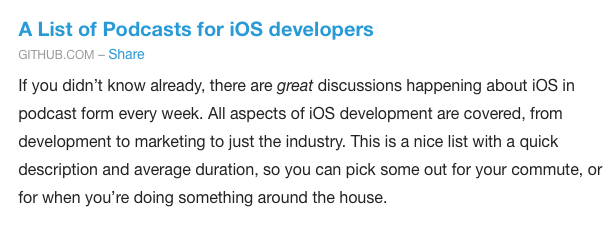

iOS-Development Podcasts
===================

The following is a list of podcasts of interest to iOS developers. Frequencies are approximate. Average length is of the past three episodes. Corrections and suggestions are welcome.

I am in the process of adding separate fields for RSS versus URL, plus Twitter. For shows that do not have dedicated Twitter accounts, hosts' accounts are listed.

### Accidental Tech Podcast
* Description: A Perl developer and two iOS developers discuss news from the Apple ecosystem and [other](http://automobiles.honda.com/accord-sedan) topics.
* URL: http://atp.fm/
* RSS: http://atp.fm/episodes?format=rss
* Twitter: [@atpfm](https://twitter.com/atpfm)
* Frequency: weekly
* Average Length: 1:39:15

### Build Phase
* Description: Three iOS developers discuss knotty programming [problems](https://github.com/thoughtbot/Argo) they are facing. This is one of the most technical iOS podcasts.
* URL: http://buildphase.fm
* RSS: http://simplecast.com/podcasts/272/rss
* Twitter: [@buildphase](https://twitter.com/buildphase)
* Frequency: weekly
* Average Length: 44:03

### CacaoCast
* Description: Two iOS developers discuss in French events and tools of interest to iOS developers. Though both are residents and apparently natives of Quebec, the untrained ear can detect a Quebec [accent](https://fr.wikipedia.org/wiki/Français_québécois) on only one of the hosts.
* URL: http://cacaocast.com/
* RSS: http://cacaocast.com/rss
* Twitter: [@cacaocast](https://twitter.com/cacaocast)
* Frequency: monthly
* Average Length: 46:24

### Coding Blocks
* Description: Three .NET and Javascript developers discuss the art of programming. This is a beard-friendly podcast.
* URL: http://www.codingblocks.net/
* RSS: http://www.codingblocks.net/feed/
* Twitter: [@codingblocks](https://twitter.com/codingblocks)
* Frequency: monthly
* Average Length: 1:53:50

### Concepts in Code
* Description: An iOS and a Java developer discuss development of a side project and other software-development subjects. The catchy intro song brings to mind the [Indigo Girls](https://www.youtube.com/watch?v=HUgwM1Ky228), a folk band founded in 1985.
* URL: http://conceptsincode.com/
* RSS: http://conceptsincode.com/rss
* Twitter: [@bjmillerltd](https://twitter.com/bjmillerltd), [@HankTurowski](https://twitter.com/HankTurowski)
* Frequency: monthly
* Average Length: 39:49

### Consult
* An interview podcast about iOS and Mac software development specifically concerning the world of consultants – those who build apps for others. Content includes a mix of topical episodes and interviews with consultants and other developers.
* URL: http://consultpodcast.com/
* RSS: http://consultpodcast.com/rss
* Twitter: [@davekopec](https://twitter.com/davekopec)
* Frequency: monthly
* Average Length: 1:07:08

### Core Intuition
* Description: An iOS and a macOS developer discuss the business of indie app development and, less frequently, more-technical subjects.
* URL: http://www.coreint.org/
* RSS: http://www.coreint.org/podcast.xml
* Twitter: [@coreint](https://twitter.com/coreint)
* Frequency: weekly
* Average Length: 47:33

### Debug
* Description: A tech journalist and an iOS developer interview various guests about subjects of interest to residents of the Apple ecosystem.
* URL: http://www.imore.com/debug
* RSS: http://feeds.feedburner.com/debugshow
* Twitter: [@debugcast](https://twitter.com/debugcast)
* Frequency: intermittent
* Average Length: 1:29:15

### Fatal Error
* Description: Two iOS developers, including one of the community's most insightful [blog](http://khanlou.com)gers, "discuss topics at the cutting edge of iOS software architecture, Swift[,](https://www.grammarly.com/blog/what-is-the-oxford-comma-and-why-do-people-care-so-much-about-it/) and best practices."
* URL: http://fatalerror.fm
* RSS: http://fatalerror.fm/episodes?format=RSS
* Twitter: [@fatalerrorfm](https://twitter.com/fatalerrorfm)
* Frequency: biweekly
* Average Length: 27:36

### iDeveloper Podcast
* Description: A Mac and iOS developer/[guru](https://youtu.be/9VojuJpUuE8?list=PLdr22uU_wISqm9QbnczWxXs9qyuWpSU4k) discuss Apple-software development and other topics.
* URL: http://blog.ideveloper.co
* RSS: http://feeds.ideveloper.co/ideveloperpodcast.xml
* Twitter: [@macdevnet](https://twitter.com/macdevnet)
* Frequency: weeklyish
* Average Length: 31:43

### iOSBytes
* Description: A quick rundown of interesting iOS development links.
* URL: https://iosbytes.codeschool.com/
* RSS: https://iosbytes.codeschool.com/feed.rss
* Twitter: [@iOSBytesPodcast](https://twitter.com/iOSBytesPodcast)
* Frequency: weekly
* Average Length: 5:06

### Immutable
* Description: A short, weekly show about design and development, usually of the iOS variety, hosted by Sam Soffes & Bryn Jackson.
* URL: https://spec.fm/podcasts/immutable
* RSS: https://simplecast.com/podcasts/1332/rss
* Twitter: [@ImmutableFM](https://twitter.com/ImmutableFM)
* Frequency: weekly
* Average Length: 17:03

### iOhYes
* Description: Three iOS developers discuss with a guest one iOS-development topic per episode.
* URL: http://5by5.tv/iohyes
* RSS: http://feeds.5by5.tv/iohyes
* Twitter: [@iOhYesPodcast](https://twitter.com/iOhYesPodcast)
* Frequency: weekly
* Average Length: 1:01:45

### iPhreaks
* Description: A Ruby developer and two iOS developers discuss with a guest one iOS-development topic per episode. The intro riff is a perhaps-unintentional homage to Police guitarist [Andy](https://www.youtube.com/watch?v=ZSShauY8D3w) [Summers](https://www.youtube.com/watch?v=mbv-LcdLY-Y).
* URL: https://devchat.tv/iphreaks
* RSS: http://feeds.feedwrench.com/iPhreaks.rss
* Twitter: [@devchattv](http://twitter.com/devchattv)
* Frequency: weekly
* Average Length: 55:19

### Merge Conflict
* Description: [Frank](http://github.com/praeclarum) and [James](http://github.com/jamesmontemagno), both cross-platform mobile developers, discuss various development topics.
* URL: http://www.mergeconflict.fm
* RSS: http://simplecast.com/podcasts/2117/rss
* Twitter: [@MergeConflictFM](https://twitter.com/MergeConflictFM)
* Frequency: weekly
* Average Length: 33:33

### Mobile & Beer
* Description: In each episode, three Israeli, Hebrew-speaking developers drink a different beer, discuss news, and share personal stories about mobile development (especially Apple & iOS).
* URL: http://www.mobileandbeer.com/
* RSS: http://www.mobileandbeer.com/podcast.xml
* Twitter: [@mobileandbeer](https://twitter.com/mobileandbeer)
* Frequency: intermittent
* Average Length: 53:48

### Mobile Couch
* Description: Two iOS developers discuss various iOS-development topics.
* URL: http://mobilecouch.co
* RSS: http://mobilecouch.co/rss
* Twitter: [@_mobilecouch](https://twitter.com/_mobilecouch)
* Frequency: biweekly
* Average Length: 45:24

### More Than Just Code
* Description: A rotating cast of iOS-developer hosts discuss news of interest to iOS developers.
* URL: http://mtjc.fm
* RSS: http://mtjc.fm/feed/podcast/
* Twitter: [@mtjc_podcast](https://twitter.com/mtjc_podcast)
* Frequency: weekly
* Average Length: 1:31:26

### Programming Throwdown
* Description: Two developers discuss one software-development topic per episode, sometimes with guests. The hosts also recommend books and technologies of general software-developer interest.
* URL: http://www.programmingthrowdown.com
* RSS: http://feeds.feedburner.com/ProgrammingThrowdown
* Twitter: [@NeuralNets4Life](https://twitter.com/NeuralNets4Life)
* Frequency: intermittent
* Average Length: 1:09:12

### raywenderlich.com Podcast
* Description: Two or three iOS developers and sometimes a guest discuss (usually) two iOS-development topics.
* URL: https://www.raywenderlich.com/rwpodcast
* RSS: http://www.raywenderlich.com/category/podcast/feed
* Twitter: [@rwenderlich](https://twitter.com/rwenderlich)
* Frequency: biweekly
* Average Length: 40:50

### Release Notes
* Description: An indie iOS developer and an indie iOS developer/designer/[bassist](http://airplanemo.de)/impresario discuss the business of indie-app development.
* URL: https://releasenotes.tv
* RSS: https://releasenotes.tv/feed/podcast/
* Twitter: [@release_notes](https://twitter.com/release_notes)
* Frequency: weekly
* Average Length: 37:46

### Runtime
* Description: Two iOS developers discuss the nuts and bolts of iOS and, in particular, Swift development.
* URL: https://spec.fm/podcasts/runtime
* RSS: https://simplecast.com/podcasts/2070/rss
* Twitter: [@runtimefm](https://twitter.com/runtimefm)
* Frequency: weekly
* Average Length: 23:42

### SharedInstance
* Description: Three iOS developers discuss various iOS-development topics.
* URL: http://sharedinstance.com
* RSS: http://simplecast.com/podcasts/1008/rss
* Twitter: [@sharedinst](https://twitter.com/sharedinst)
* Frequency: weekly
* Average Length: 36:32

### Simple Programmer Podcast
* Description: A former developer and current [writer](https://www.amazon.com/Soft-Skills-software-developers-manual/dp/1617292397/)/life coach answers questions from software developers.
* URL: https://simpleprogrammer.com/podcasts/
* RSS: http://simpleprogrammer.libsyn.com/rss
* Twitter: [@jsonmez](https://twitter.com/jsonmez)
* Frequency: daily
* Average Length: 5:51

### Software Engineering Daily
* Description: A former developer interviews one guest per episode about topics of interest to software developers.
* URL: http://softwareengineeringdaily.com
* RSS: http://softwareengineeringdaily.com/feed/podcast/
* Twitter: [@software_daily](https://twitter.com/software_daily)
* Frequency: daily
* Average Length: 58:09

### Supertop Podcast
* Description: Two Irish developers of an iOS app drawing upon that country's tradition of amazing [craftsmanship](https://www.tcd.ie/Library/manuscripts/book-of-kells.php) discuss app development and sometimes interview [guests](http://inessential.com).
* URL: http://supertop.co
* RSS: http://cast.rocks/hosting/2041/feeds/CQMQA.xml
* Twitter: [@supertopsquid](https://twitter.com/supertopsquid)
* Frequency: weekly
* Average Length: 43:42

### SwiftCoders
* Description: An iOS developer interviews a different iOS or Mac developer each week about developing for Apple platforms. The [host](https://twitter.com/garricn) uses an interesting [app](https://tryca.st) to record, edit, publish, and host the podcast.
* URL: http://swiftcoders.podbean.com/feed/
* RSS: http://swiftcoders.podbean.com
* Twitter: [@garricn](https://twitter.com/garricn)
* Frequency: weekly
* Average Length: 63:42

### Swift Playhouse
* Description: Two Swift learners discuss Swift-learning resources and the learning process.
* URL: http://www.swiftplayhouse.com
* RSS: http://swiftplayhouse.libsyn.com/rss
* Twitter: [@swiftplayhouse](https://twitter.com/swiftplayhouse)
* Frequency: weekly
* Average Length: 14:40

### The Talk Show with John Gruber
* Description: A blogger and former Perl developer discusses with a guest news from the Apple ecosystem, often addressing topics of interest to developers. Interviews with Apple executives are particularly enlightening.
* URL: http://daringfireball.net/thetalkshow/
* RSS: http://daringfireball.net/thetalkshow/rss
* Twitter: [@thetalkshow](https://twitter.com/thetalkshow)
* Frequency: weekly
* Average Length: 1:56:40

### Tentative
* Description: Two digital-product designers discuss digital-product design, often addressing subjects of interest to iOS developers.
* URL: http://tentative.fm
* RSS: http://simplecast.com/podcasts/1088/rss
* Twitter: [@tentativefm](https://twitter.com/tentativefm)
* Frequency: weekly
* Average Length: 31:01

### Topical
* Description: Two entrepreneurial iOS developers discuss one topic per episode, often directly or tangentially related to iOS development.
* URL: http://topical.fm
* RSS: https://podcasts.jellystyle.com/topical/rss
* Twitter: [@topicalfm](http://twitter.com/topicalfm)
* Frequency: weekly
* Average Length: 21:02

### Under the Radar
* Description: Two indie iOS developers discuss the business, nuts, and bolts of indie iOS-app development.
* URL: https://www.relay.fm/radar/
* RSS: https://www.relay.fm/radar/feed
* Twitter: [@_DavidSmith](http://twitter.com/_DavidSmith)
* Frequency: weekly
* Average Length: 29:24

### Verbose Podcast
* Description: Three 🇮🇪 iOS developers [discuss](http://www.ireland-fun-facts.com/craic.html) iOS development, the business of app selling, and news from the Apple ecosystem.
* URL: http://verbosepodca.st
* RSS: http://verbose-ireland.s3.amazonaws.com/the-verbose-podcast.xml
* Twitter: [@oisin](http://twitter.com/oisin)
* Frequency: gach mí
* Average Length: 1:31:42

### Worst Case Scenario
* Description: Three iOS developers from Limerick, Ireland discuss app development, tech, education[,](https://www.grammarly.com/blog/what-is-the-oxford-comma-and-why-do-people-care-so-much-about-it/) and life.
* URL: http://worstcasescenario.ie
* RSS: http://worstcasescenario.ie/feed/podcast
* Twitter: [@TheDaveSims](http://twitter.com/TheDaveSims)
* Frequency: weekly
* Average Length: 1:00:18

Dearly Departed Podcasts
========================
* CocoaRadio
* Bitsplitting
* Edge Cases
* History of Rome
* Identical Cousins
* Notification Center
* NSBrief
* The Record
* Springboard

Credits
=======
Thanks to all the podcasts and to [iOS Dev Weekly](https://iosdevweekly.com), [Indie iOS Focus Weekly](https://indieiosfocus.curated.co), [Launch Therapy] for helping to publicize this list.

